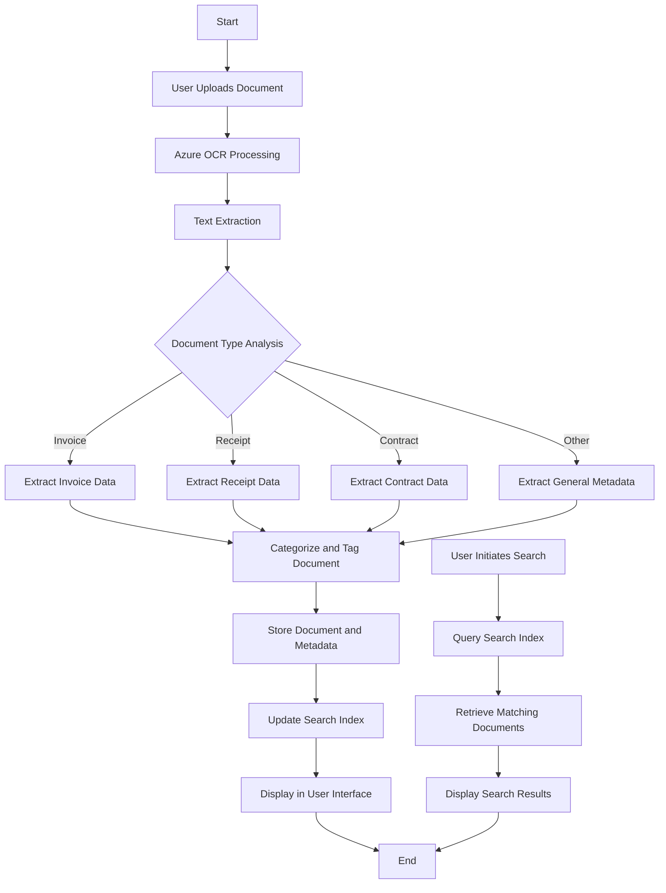

# .NET Document Analyzer and Organizer

## Project Overview
A .NET application that uses Azure OCR to scan, analyze, and organize documents based on their content.

## Key Features
1. Document upload
2. OCR processing using Azure Computer Vision API
3. Content analysis and categorization
4. Metadata extraction
5. Automated document organization
6. Search functionality
7. User-friendly interface

## Technical Components
- C# programming
- Azure Cognitive Services integration
- Text processing and analysis
- File management system
- User interface development

## Benefits
- Efficient document management
- Quick information retrieval
- Practical experience with Azure services and C# development

## Potential Extensions
- Multi-language support
- Integration with cloud storage services
- Machine learning for improved categorization

## Application Flow

